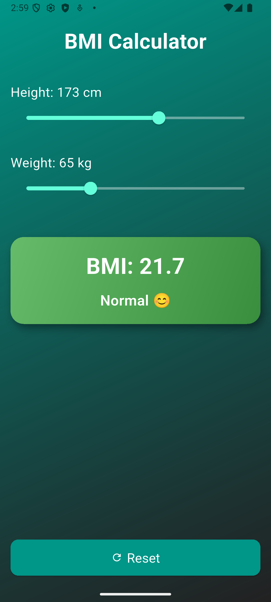
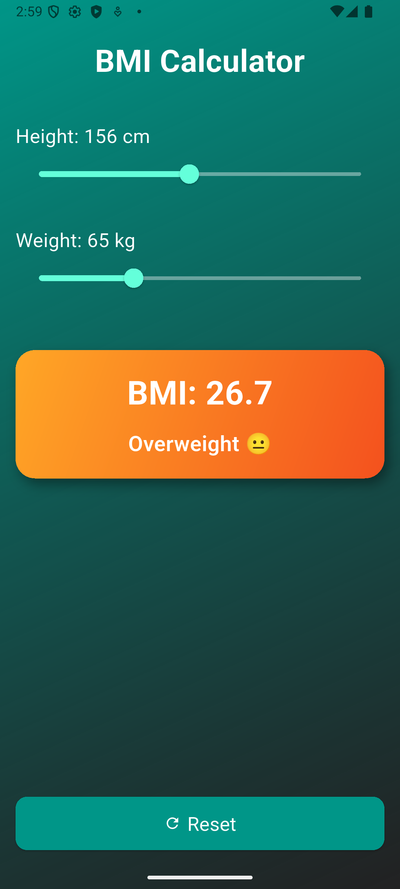
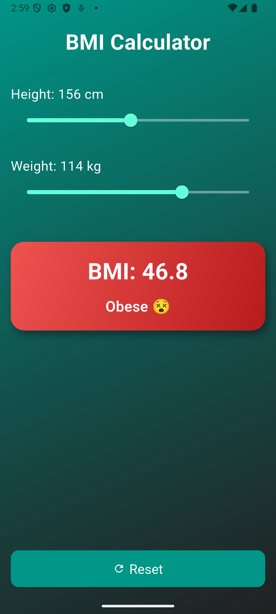

# 📱 BMI Calculator App (Flutter)

This is my **BMI Calculator App project** made using Flutter.  
It is a **fun and interactive app** where the user can set **Height** and **Weight** using sliders, and the app will **calculate and display the BMI instantly**.  
The app also shows the **BMI category** (Underweight, Normal, Overweight, Obese) with **colors and emojis**.

---

## ✨ Features
- 🎚️ Height & Weight input using sliders
- 📊 Real-time BMI calculation
- 🌈 Gradient result box with attractive colors
- 😀 Emoji-based BMI categories
- 🔄 Reset button to start fresh
- 🎨 Clean and modern UI design

---

## 📸 Screenshots

Here are three screenshots of my app:

| Normal BMI | Overweight BMI | Obese BMI |
|------------|----------------|-----------|
|  |  |  |

---
